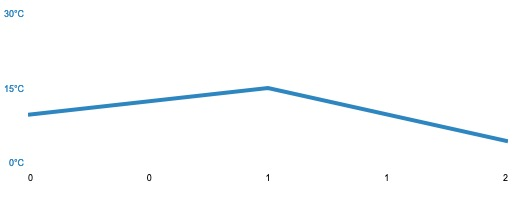
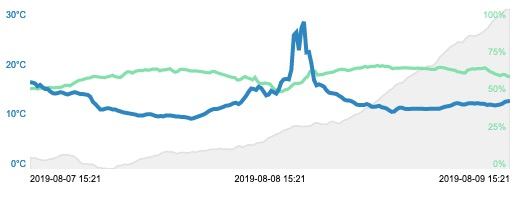

# simple-graphs

[](https://travis-ci.org/5orenso/simple-graphs)
[](https://coveralls.io/github/5orenso/simple-graphs?branch=master)
[](https://badge.fury.io/gh/5orenso%2Fsimple-graphs)

A nice and light graph module for use on your website.

### Howto to get started

1. Get the [release file](release/simple-graphs-0.1.0.js) and place it somewhere nice on your server.

2. Add this to your html:
```html
<div data-widget-host="simpleGraph">
    <script type="text/props">
        {
            "jsonData": "[{\"x\":0, \"y\":10},{\"x\":1, \"y\":15},{\"x\":2, \"y\":5}]",
            "width": 600,
            "height": 200,
            "yMax": 30,
            "showYTicks": 1,
            "yTicks": "[\"30°C\",\"15°C\",\"0°C\"]",
            "showXTicks": 1,
        }
    </script>
</div>
<script type="text/javascript" src="simple-graphs-0.1.0.js"></script>
```

Then you should have a scalable SVG graph looking like this:


### More examples

And if you, like me, use it for your IoT projects you can acheive this.

```html
<div data-widget-host="simpleGraph" style="width: 500px; border: 1px solid #ff0000; padding: 10px;">
    <script type="text/props">
      {
        "jsonData": "[{\"x\":0,\"y\":19},{\"x\":1,\"y\":18.899999618530273},{\"x\":2,\"y\":18.700000762939453},{\"x\":3,\"y\":18.100000381469727},{\"x\":4,\"y\":18.399999618530273},{\"x\":5,\"y\":17.899999618530273},{\"x\":6,\"y\":17.5},{\"x\":7,\"y\":17.5},{\"x\":8,\"y\":17},{\"x\":9,\"y\":16.600000381469727},{\"x\":10,\"y\":16.5},{\"x\":11,\"y\":16.600000381469727},{\"x\":12,\"y\":16.799999237060547},{\"x\":13,\"y\":16.700000762939453},{\"x\":14,\"y\":16.449999809265137},{\"x\":15,\"y\":16.299999237060547},{\"x\":16,\"y\":16.5},{\"x\":17,\"y\":16.700000762939453},{\"x\":18,\"y\":16.799999237060547},{\"x\":19,\"y\":16.600000381469727},{\"x\":20,\"y\":16.399999618530273},{\"x\":21,\"y\":16.399999618530273},{\"x\":22,\"y\":16.299999237060547},{\"x\":23,\"y\":16.200000762939453},{\"x\":24,\"y\":15.800000190734863},{\"x\":25,\"y\":14.699999809265137},{\"x\":26,\"y\":14.199999809265137},{\"x\":27,\"y\":13.600000381469727},{\"x\":28,\"y\":13},{\"x\":29,\"y\":13},{\"x\":30,\"y\":13.199999809265137},{\"x\":31,\"y\":13.300000190734863},{\"x\":32,\"y\":13.199999809265137},{\"x\":33,\"y\":13},{\"x\":34,\"y\":13},{\"x\":35,\"y\":12.75},{\"x\":36,\"y\":12.600000381469727},{\"x\":37,\"y\":12.399999618530273},{\"x\":38,\"y\":12.300000190734863},{\"x\":39,\"y\":12.199999809265137},{\"x\":40,\"y\":12.100000381469727},{\"x\":41,\"y\":12},{\"x\":42,\"y\":11.899999618530273},{\"x\":43,\"y\":11.699999809265137},{\"x\":44,\"y\":11.699999809265137},{\"x\":45,\"y\":11.699999809265137},{\"x\":46,\"y\":11.899999618530273},{\"x\":47,\"y\":12},{\"x\":48,\"y\":12},{\"x\":49,\"y\":11.800000190734863},{\"x\":50,\"y\":11.600000381469727},{\"x\":51,\"y\":11.5},{\"x\":52,\"y\":11.600000381469727},{\"x\":53,\"y\":11.5},{\"x\":54,\"y\":11.699999809265137},{\"x\":55,\"y\":11.699999809265137},{\"x\":56,\"y\":11.699999809265137},{\"x\":57,\"y\":11.600000381469727},{\"x\":58,\"y\":11.5},{\"x\":59,\"y\":11.5},{\"x\":60,\"y\":11.399999618530273},{\"x\":61,\"y\":11.399999618530273},{\"x\":62,\"y\":11.300000190734863},{\"x\":63,\"y\":11.199999809265137},{\"x\":64,\"y\":11},{\"x\":65,\"y\":11.100000381469727},{\"x\":66,\"y\":11.300000190734863},{\"x\":67,\"y\":11.5},{\"x\":68,\"y\":11.699999809265137},{\"x\":69,\"y\":11.899999618530273},{\"x\":70,\"y\":12.199999809265137},{\"x\":71,\"y\":12.600000381469727},{\"x\":72,\"y\":12.899999618530273},{\"x\":73,\"y\":13.100000381469727},{\"x\":74,\"y\":13.100000381469727},{\"x\":75,\"y\":13.199999809265137},{\"x\":76,\"y\":13.399999618530273},{\"x\":77,\"y\":13.600000381469727},{\"x\":78,\"y\":13.849999904632568},{\"x\":79,\"y\":13.899999618530273},{\"x\":80,\"y\":14.100000381469727},{\"x\":81,\"y\":14.399999618530273},{\"x\":82,\"y\":14.5},{\"x\":83,\"y\":14.199999809265137},{\"x\":84,\"y\":14.600000381469727},{\"x\":85,\"y\":15.300000190734863},{\"x\":86,\"y\":16},{\"x\":87,\"y\":16.899999618530273},{\"x\":88,\"y\":17.600000381469727},{\"x\":89,\"y\":17.5},{\"x\":90,\"y\":17.299999237060547},{\"x\":91,\"y\":18},{\"x\":92,\"y\":17.700000762939453},{\"x\":93,\"y\":16.899999618530273},{\"x\":94,\"y\":16.100000381469727},{\"x\":95,\"y\":16.299999237060547},{\"x\":96,\"y\":17.100000381469727},{\"x\":97,\"y\":16.799999237060547},{\"x\":98,\"y\":16.5},{\"x\":99,\"y\":17.399999618530273},{\"x\":100,\"y\":19},{\"x\":101,\"y\":19.600000381469727},{\"x\":102,\"y\":19.700000762939453},{\"x\":103,\"y\":19.600000381469727},{\"x\":104,\"y\":21.700000762939453},{\"x\":105,\"y\":29.299999237060547},{\"x\":106,\"y\":29.899999618530273},{\"x\":107,\"y\":26},{\"x\":108,\"y\":30.799999237060547},{\"x\":109,\"y\":32.20000076293945},{\"x\":110,\"y\":25.5},{\"x\":111,\"y\":25.600000381469727},{\"x\":112,\"y\":23},{\"x\":113,\"y\":19.5},{\"x\":114,\"y\":18.299999237060547},{\"x\":115,\"y\":18.5},{\"x\":116,\"y\":18.299999237060547},{\"x\":117,\"y\":18},{\"x\":118,\"y\":17.200000762939453},{\"x\":119,\"y\":16.700000762939453},{\"x\":120,\"y\":16.600000381469727},{\"x\":121,\"y\":16.5},{\"x\":122,\"y\":16.399999618530273},{\"x\":123,\"y\":16},{\"x\":124,\"y\":15.699999809265137},{\"x\":125,\"y\":15.199999809265137},{\"x\":126,\"y\":15},{\"x\":127,\"y\":15},{\"x\":128,\"y\":14.800000190734863},{\"x\":129,\"y\":14.5},{\"x\":130,\"y\":14.100000381469727},{\"x\":131,\"y\":14},{\"x\":132,\"y\":14},{\"x\":133,\"y\":14},{\"x\":134,\"y\":14.199999809265137},{\"x\":135,\"y\":14},{\"x\":136,\"y\":13.600000381469727},{\"x\":137,\"y\":13.600000381469727},{\"x\":138,\"y\":13.699999809265137},{\"x\":139,\"y\":13.800000190734863},{\"x\":140,\"y\":13.5},{\"x\":141,\"y\":13.399999618530273},{\"x\":142,\"y\":13.199999809265137},{\"x\":143,\"y\":12.800000190734863},{\"x\":144,\"y\":12.5},{\"x\":145,\"y\":12.600000381469727},{\"x\":146,\"y\":13.100000381469727},{\"x\":147,\"y\":13.399999618530273},{\"x\":148,\"y\":13.399999618530273},{\"x\":149,\"y\":13.199999809265137},{\"x\":150,\"y\":13.100000381469727},{\"x\":151,\"y\":13.100000381469727},{\"x\":152,\"y\":13.199999809265137},{\"x\":153,\"y\":13.199999809265137},{\"x\":154,\"y\":13.199999809265137},{\"x\":155,\"y\":13.199999809265137},{\"x\":156,\"y\":13.199999809265137},{\"x\":157,\"y\":13.100000381469727},{\"x\":158,\"y\":13.100000381469727},{\"x\":159,\"y\":13.199999809265137},{\"x\":160,\"y\":13.199999809265137},{\"x\":161,\"y\":13.199999809265137},{\"x\":162,\"y\":13.199999809265137},{\"x\":163,\"y\":13.199999809265137},{\"x\":164,\"y\":13.399999618530273},{\"x\":165,\"y\":13.600000381469727},{\"x\":166,\"y\":13.699999809265137},{\"x\":167,\"y\":13.800000190734863},{\"x\":168,\"y\":14},{\"x\":169,\"y\":14.300000190734863},{\"x\":170,\"y\":14.399999618530273},{\"x\":171,\"y\":14.300000190734863},{\"x\":172,\"y\":14.100000381469727},{\"x\":173,\"y\":14.100000381469727},{\"x\":174,\"y\":14.300000190734863},{\"x\":175,\"y\":14.399999618530273},{\"x\":176,\"y\":14.399999618530273},{\"x\":177,\"y\":14.300000190734863},{\"x\":178,\"y\":14.399999618530273},{\"x\":179,\"y\":14.300000190734863},{\"x\":180,\"y\":14.300000190734863},{\"x\":181,\"y\":14.199999809265137},{\"x\":182,\"y\":14},{\"x\":183,\"y\":14.100000381469727},{\"x\":184,\"y\":14},{\"x\":185,\"y\":13.899999618530273},{\"x\":186,\"y\":14},{\"x\":187,\"y\":14.100000381469727},{\"x\":188,\"y\":14.300000190734863},{\"x\":189,\"y\":14.699999809265137},{\"x\":190,\"y\":14.800000190734863},{\"x\":191,\"y\":14.899999618530273}]",
        "jsonData2": "[{\"x\":0,\"y\":50.08648650710647},{\"x\":1,\"y\":50.42666670481364},{\"x\":2,\"y\":50.273333358764646},{\"x\":3,\"y\":50.09499988555908},{\"x\":4,\"y\":50.27833309173584},{\"x\":5,\"y\":50.56000016530355},{\"x\":6,\"y\":50.91666679382324},{\"x\":7,\"y\":50.869999694824216},{\"x\":8,\"y\":50.964999961853025},{\"x\":9,\"y\":50.77999998728434},{\"x\":10,\"y\":50.75666694641113},{\"x\":11,\"y\":51.00499986012777},{\"x\":12,\"y\":50.981666819254556},{\"x\":13,\"y\":51.4099999109904},{\"x\":14,\"y\":52.223333549499515},{\"x\":15,\"y\":52.368333435058595},{\"x\":16,\"y\":51.96499983469645},{\"x\":17,\"y\":53.12666657765706},{\"x\":18,\"y\":53.9559321645963},{\"x\":19,\"y\":54.95166670481364},{\"x\":20,\"y\":55.56166667938233},{\"x\":21,\"y\":55.75833314259847},{\"x\":22,\"y\":56.36000010172526},{\"x\":23,\"y\":56.835000101725264},{\"x\":24,\"y\":56.88500035603841},{\"x\":25,\"y\":57.69333349863688},{\"x\":26,\"y\":57.833333524068195},{\"x\":27,\"y\":57.588333193461104},{\"x\":28,\"y\":57.35666643778483},{\"x\":29,\"y\":57.23666655222575},{\"x\":30,\"y\":57.0916664759318},{\"x\":31,\"y\":57.65333334604899},{\"x\":32,\"y\":57.951666831970215},{\"x\":33,\"y\":58.58166675567627},{\"x\":34,\"y\":57.70833320617676},{\"x\":35,\"y\":57.436666615804036},{\"x\":36,\"y\":57.164999898274736},{\"x\":37,\"y\":58.19499994913737},{\"x\":38,\"y\":59.69833354949951},{\"x\":39,\"y\":60.77000013987223},{\"x\":40,\"y\":60.63666687011719},{\"x\":41,\"y\":59.951666577657065},{\"x\":42,\"y\":60.920000139872236},{\"x\":43,\"y\":61.36999994913737},{\"x\":44,\"y\":61.59333356221517},{\"x\":45,\"y\":61.53833351135254},{\"x\":46,\"y\":62.053333346048994},{\"x\":47,\"y\":61.79333324432373},{\"x\":48,\"y\":61.89500007629395},{\"x\":49,\"y\":62.46499989827474},{\"x\":50,\"y\":62.46999994913737},{\"x\":51,\"y\":62.45833346048991},{\"x\":52,\"y\":61.326666514078774},{\"x\":53,\"y\":61.951666768391924},{\"x\":54,\"y\":61.95999997456868},{\"x\":55,\"y\":62.2633331934611},{\"x\":56,\"y\":62.70500005086263},{\"x\":57,\"y\":61.44999980926514},{\"x\":58,\"y\":60.47333348592122},{\"x\":59,\"y\":60.89333330790202},{\"x\":60,\"y\":62.24666697184245},{\"x\":61,\"y\":62.34333356221517},{\"x\":62,\"y\":62.066666793823245},{\"x\":63,\"y\":61.88999989827474},{\"x\":64,\"y\":61.36000010172526},{\"x\":65,\"y\":61.20500030517578},{\"x\":66,\"y\":61.343333625793456},{\"x\":67,\"y\":61.138333002726235},{\"x\":68,\"y\":61.018333498636885},{\"x\":69,\"y\":60.78000011444092},{\"x\":70,\"y\":60.363333257039386},{\"x\":71,\"y\":60.166666221618655},{\"x\":72,\"y\":60.135593349650755},{\"x\":73,\"y\":61.07333335876465},{\"x\":74,\"y\":60.80000019073486},{\"x\":75,\"y\":60.083333587646486},{\"x\":76,\"y\":59.66000010172526},{\"x\":77,\"y\":59.103333218892416},{\"x\":78,\"y\":58.70666662851969},{\"x\":79,\"y\":58.128333282470706},{\"x\":80,\"y\":57.66333325703939},{\"x\":81,\"y\":57.198333422342934},{\"x\":82,\"y\":57.07000001271566},{\"x\":83,\"y\":55.621666717529294},{\"x\":84,\"y\":55.756666564941405},{\"x\":85,\"y\":56.87333335876465},{\"x\":86,\"y\":57.759999910990395},{\"x\":87,\"y\":56.99333324432373},{\"x\":88,\"y\":56.46333332061768},{\"x\":89,\"y\":55.701666895548506},{\"x\":90,\"y\":57.32666670481364},{\"x\":91,\"y\":54.72666676839193},{\"x\":92,\"y\":53.488333257039386},{\"x\":93,\"y\":53.39999987284342},{\"x\":94,\"y\":53.69833354949951},{\"x\":95,\"y\":53.4},{\"x\":96,\"y\":53.06166667938233},{\"x\":97,\"y\":51.1566665649414},{\"x\":98,\"y\":49.3349999109904},{\"x\":99,\"y\":49.62333335876465},{\"x\":100,\"y\":48.271666526794434},{\"x\":101,\"y\":48.475000063578285},{\"x\":102,\"y\":49.4649995803833},{\"x\":103,\"y\":49.714999961853025},{\"x\":104,\"y\":50.9349999109904},{\"x\":105,\"y\":52.48500003814697},{\"x\":106,\"y\":53.55333340962728},{\"x\":107,\"y\":53.46166655222575},{\"x\":108,\"y\":53.65500011444092},{\"x\":109,\"y\":54.44333343505859},{\"x\":110,\"y\":56.579999860127764},{\"x\":111,\"y\":57.71999988555908},{\"x\":112,\"y\":60.888333257039385},{\"x\":113,\"y\":61.00499992370605},{\"x\":114,\"y\":61.136666488647464},{\"x\":115,\"y\":58.71499989827474},{\"x\":116,\"y\":58.95666675567627},{\"x\":117,\"y\":58.96166674296061},{\"x\":118,\"y\":59.72000013987223},{\"x\":119,\"y\":60.041666730244955},{\"x\":120,\"y\":60.24333324432373},{\"x\":121,\"y\":60.41166667938232},{\"x\":122,\"y\":61.138333257039385},{\"x\":123,\"y\":61.760000165303545},{\"x\":124,\"y\":62.26101691035901},{\"x\":125,\"y\":62.3283332824707},{\"x\":126,\"y\":62.11166636149088},{\"x\":127,\"y\":61.60833339691162},{\"x\":128,\"y\":61.72499993642171},{\"x\":129,\"y\":62.335592884128374},{\"x\":130,\"y\":62.763333257039385},{\"x\":131,\"y\":63.131666628519696},{\"x\":132,\"y\":63.051666514078775},{\"x\":133,\"y\":63.44499969482422},{\"x\":134,\"y\":64.13833312988281},{\"x\":135,\"y\":63.583333269755045},{\"x\":136,\"y\":63.999999872843425},{\"x\":137,\"y\":64.1583330154419},{\"x\":138,\"y\":64.19499931335449},{\"x\":139,\"y\":64.72500038146973},{\"x\":140,\"y\":64.14666595458985},{\"x\":141,\"y\":64.53499927520753},{\"x\":142,\"y\":64.11666647593181},{\"x\":143,\"y\":64.17166659037272},{\"x\":144,\"y\":63.70666694641113},{\"x\":145,\"y\":62.66271190320031},{\"x\":146,\"y\":62.974999618530276},{\"x\":147,\"y\":63.09333299001058},{\"x\":148,\"y\":63.04833297729492},{\"x\":149,\"y\":63.16833330790202},{\"x\":150,\"y\":63.28500010172526},{\"x\":151,\"y\":63.22333323160807},{\"x\":152,\"y\":63.03389798180532},{\"x\":153,\"y\":63.0084745116153},{\"x\":154,\"y\":62.86333363850911},{\"x\":155,\"y\":63.068332799275716},{\"x\":156,\"y\":62.96666711171468},{\"x\":157,\"y\":62.848333740234374},{\"x\":158,\"y\":62.806666946411134},{\"x\":159,\"y\":62.643332926432294},{\"x\":160,\"y\":62.398305408025195},{\"x\":161,\"y\":62.23793102132863},{\"x\":162,\"y\":62.23220346741757},{\"x\":163,\"y\":63.25084712141651},{\"x\":164,\"y\":63.50847425299176},{\"x\":165,\"y\":63.37666670481364},{\"x\":166,\"y\":63.09322040363894},{\"x\":167,\"y\":62.55593225511454},{\"x\":168,\"y\":62.226666895548504},{\"x\":169,\"y\":61.93389795594296},{\"x\":170,\"y\":61.66166674296061},{\"x\":171,\"y\":60.813559192722124},{\"x\":172,\"y\":60.55999997456868},{\"x\":173,\"y\":60.11694891978119},{\"x\":174,\"y\":59.98833376566569},{\"x\":175,\"y\":61.746666781107585},{\"x\":176,\"y\":62.24745734263275},{\"x\":177,\"y\":62.61666679382324},{\"x\":178,\"y\":62.43499965667725},{\"x\":179,\"y\":62.77666676839193},{\"x\":180,\"y\":62.73166669209798},{\"x\":181,\"y\":62.84915271047819},{\"x\":182,\"y\":63.2683333714803},{\"x\":183,\"y\":62.09333324432373},{\"x\":184,\"y\":60.86666673024495},{\"x\":185,\"y\":60.29999980926514},{\"x\":186,\"y\":59.366666348775226},{\"x\":187,\"y\":58.996666781107585},{\"x\":188,\"y\":58.27833315531413},{\"x\":189,\"y\":59.07500025431315},{\"x\":190,\"y\":58.996666463216144},{\"x\":191,\"y\":58.003333473205565},{\"x\":192,\"y\":57.58695569245712}]",
        "jsonData3": "[{\"x\":0,\"y\":936.4928588867188},{\"x\":1,\"y\":936.460009765625},{\"x\":2,\"y\":936.4683410644532},{\"x\":3,\"y\":936.408354695638},{\"x\":4,\"y\":936.3566752115886},{\"x\":5,\"y\":936.3400024414062},{\"x\":6,\"y\":936.3099914550781},{\"x\":7,\"y\":936.3500061035156},{\"x\":8,\"y\":936.4050231933594},{\"x\":9,\"y\":936.4150197347005},{\"x\":10,\"y\":936.4750061035156},{\"x\":11,\"y\":936.5116638183594},{\"x\":12,\"y\":936.6233184814453},{\"x\":13,\"y\":936.6533284505208},{\"x\":14,\"y\":936.6516611735026},{\"x\":15,\"y\":936.6750030517578},{\"x\":16,\"y\":936.6116465250651},{\"x\":17,\"y\":936.6033101399739},{\"x\":18,\"y\":936.5166625976562},{\"x\":19,\"y\":936.4100128173828},{\"x\":20,\"y\":936.223334757487},{\"x\":21,\"y\":936.1116465250651},{\"x\":22,\"y\":936.1016428629557},{\"x\":23,\"y\":936.0983093261718},{\"x\":24,\"y\":936.0766479492188},{\"x\":25,\"y\":936.0816467285156},{\"x\":26,\"y\":935.9983337402343},{\"x\":27,\"y\":935.878348795573},{\"x\":28,\"y\":935.8783498128255},{\"x\":29,\"y\":935.8366678873698},{\"x\":30,\"y\":935.845004272461},{\"x\":31,\"y\":935.7983235677083},{\"x\":32,\"y\":935.8033223470052},{\"x\":33,\"y\":935.8033223470052},{\"x\":34,\"y\":935.8633433024089},{\"x\":35,\"y\":935.9883361816406},{\"x\":36,\"y\":936.0033325195312},{\"x\":37,\"y\":936.0233276367187},{\"x\":38,\"y\":936.0983103434245},{\"x\":39,\"y\":936.0516540527344},{\"x\":40,\"y\":936.1016428629557},{\"x\":41,\"y\":936.1499918619792},{\"x\":42,\"y\":936.2266723632813},{\"x\":43,\"y\":936.3049896240234},{\"x\":44,\"y\":936.3983540852864},{\"x\":45,\"y\":936.42001953125},{\"x\":46,\"y\":936.4500111897786},{\"x\":47,\"y\":936.5016662597657},{\"x\":48,\"y\":936.5},{\"x\":49,\"y\":936.5499877929688},{\"x\":50,\"y\":936.6233184814453},{\"x\":51,\"y\":936.6133138020833},{\"x\":52,\"y\":936.7000122070312},{\"x\":53,\"y\":936.7898207842294},{\"x\":54,\"y\":936.8400024414062},{\"x\":55,\"y\":936.8483388264974},{\"x\":56,\"y\":936.823329671224},{\"x\":57,\"y\":936.8400024414062},{\"x\":58,\"y\":936.7616638183594},{\"x\":59,\"y\":936.7316711425781},{\"x\":60,\"y\":936.7916564941406},{\"x\":61,\"y\":936.7983225504557},{\"x\":62,\"y\":936.7849914550782},{\"x\":63,\"y\":936.7716613769531},{\"x\":64,\"y\":936.7916564941406},{\"x\":65,\"y\":936.8550079345703},{\"x\":66,\"y\":936.8066569010417},{\"x\":67,\"y\":936.8333333333334},{\"x\":68,\"y\":936.9016906738282},{\"x\":69,\"y\":936.8983278436176},{\"x\":70,\"y\":936.896684773763},{\"x\":71,\"y\":936.92001953125},{\"x\":72,\"y\":936.9800048828125},{\"x\":73,\"y\":936.9983337402343},{\"x\":74,\"y\":936.9816711425781},{\"x\":75,\"y\":936.9950012207031},{\"x\":76,\"y\":937.0491405422405},{\"x\":77,\"y\":937.0016945014565},{\"x\":78,\"y\":936.9983337402343},{\"x\":79,\"y\":937},{\"x\":80,\"y\":936.9933349609375},{\"x\":81,\"y\":936.9783386230469},{\"x\":82,\"y\":937.0683176676432},{\"x\":83,\"y\":937.161664835612},{\"x\":84,\"y\":937.1966211351298},{\"x\":85,\"y\":937.1103242019127},{\"x\":86,\"y\":937.1677970239672},{\"x\":87,\"y\":937.2508472507283},{\"x\":88,\"y\":937.2711812682071},{\"x\":89,\"y\":937.2250061035156},{\"x\":90,\"y\":937.2999888274629},{\"x\":91,\"y\":937.3796779826536},{\"x\":92,\"y\":937.4000244140625},{\"x\":93,\"y\":937.4152749271716},{\"x\":94,\"y\":937.5},{\"x\":95,\"y\":937.6440657276219},{\"x\":96,\"y\":937.7183410644532},{\"x\":97,\"y\":937.7898207842294},{\"x\":98,\"y\":937.8583424886068},{\"x\":99,\"y\":937.9250183105469},{\"x\":100,\"y\":937.9728879766949},{\"x\":101,\"y\":938.0949768066406},{\"x\":102,\"y\":938.1499938964844},{\"x\":103,\"y\":938.2183410644532},{\"x\":104,\"y\":938.2599975585938},{\"x\":105,\"y\":938.3762869107521},{\"x\":106,\"y\":938.4050231933594},{\"x\":107,\"y\":938.4050231933594},{\"x\":108,\"y\":938.3833516438802},{\"x\":109,\"y\":938.3683461507161},{\"x\":110,\"y\":938.3683461507161},{\"x\":111,\"y\":938.3900207519531},{\"x\":112,\"y\":938.3866861979167},{\"x\":113,\"y\":938.4833374023438},{\"x\":114,\"y\":938.5899780273437},{\"x\":115,\"y\":938.5899780273437},{\"x\":116,\"y\":938.52666015625},{\"x\":117,\"y\":938.5033325195312},{\"x\":118,\"y\":938.4983337402343},{\"x\":119,\"y\":938.5183288574219},{\"x\":120,\"y\":938.639990234375},{\"x\":121,\"y\":938.6800048828125},{\"x\":122,\"y\":938.6199829101563},{\"x\":123,\"y\":938.5649841308593},{\"x\":124,\"y\":938.5449940999349},{\"x\":125,\"y\":938.6916707356771},{\"x\":126,\"y\":938.7699951171875},{\"x\":127,\"y\":938.7983215332031},{\"x\":128,\"y\":938.9083465576172},{\"x\":129,\"y\":938.9816711425781},{\"x\":130,\"y\":939.094980875651},{\"x\":131,\"y\":939.1083119710287},{\"x\":132,\"y\":939.1950022379557},{\"x\":133,\"y\":939.2966583251953},{\"x\":134,\"y\":939.4366780598958},{\"x\":135,\"y\":939.5},{\"x\":136,\"y\":939.5283264160156},{\"x\":137,\"y\":939.6883361816406},{\"x\":138,\"y\":939.8149983723958},{\"x\":139,\"y\":939.9416809082031},{\"x\":140,\"y\":940.0599853515625},{\"x\":141,\"y\":940.2216654459636},{\"x\":142,\"y\":940.3199951171875},{\"x\":143,\"y\":940.4533447265625},{\"x\":144,\"y\":940.586419574285},{\"x\":145,\"y\":940.6549936930338},{\"x\":146,\"y\":940.8433430989584},{\"x\":147,\"y\":940.9450134277344},{\"x\":148,\"y\":941},{\"x\":149,\"y\":941.0083312988281},{\"x\":150,\"y\":941.1616597493489},{\"x\":151,\"y\":941.316660563151},{\"x\":152,\"y\":941.406689453125},{\"x\":153,\"y\":941.4966674804688},{\"x\":154,\"y\":941.5816507975261},{\"x\":155,\"y\":941.7033437093099},{\"x\":156,\"y\":941.77666015625},{\"x\":157,\"y\":941.786664835612},{\"x\":158,\"y\":941.9066884358724},{\"x\":159,\"y\":942.0349914550782},{\"x\":160,\"y\":942.0199951171875},{\"x\":161,\"y\":942.0283264160156},{\"x\":162,\"y\":942.1583312988281},{\"x\":163,\"y\":942.3266693115235},{\"x\":164,\"y\":942.5799814860026},{\"x\":165,\"y\":942.7100036621093},{\"x\":166,\"y\":942.8700103759766},{\"x\":167,\"y\":943},{\"x\":168,\"y\":943.1633321126302},{\"x\":169,\"y\":943.263330078125},{\"x\":170,\"y\":943.3316660563152},{\"x\":171,\"y\":943.4666748046875},{\"x\":172,\"y\":943.4796659825212},{\"x\":173,\"y\":943.4466796875},{\"x\":174,\"y\":943.6533284505208},{\"x\":175,\"y\":943.794915668035},{\"x\":176,\"y\":943.8700134277344},{\"x\":177,\"y\":943.8650115966797},{\"x\":178,\"y\":943.8288119041314},{\"x\":179,\"y\":943.9000244140625},{\"x\":180,\"y\":943.9661099708686},{\"x\":181,\"y\":944.066650390625},{\"x\":182,\"y\":944.1816619873047},{\"x\":183,\"y\":944.2999971034163},{\"x\":184,\"y\":944.5166687011719},{\"x\":185,\"y\":944.7120761213631},{\"x\":186,\"y\":944.8700073242187},{\"x\":187,\"y\":944.9847494868909},{\"x\":188,\"y\":945.0983123779297},{\"x\":189,\"y\":945.2118737172273},{\"x\":190,\"y\":945.4083323160808},{\"x\":191,\"y\":945.461026466499},{\"x\":192,\"y\":945.4741998487904}]",
        "width": 600,
        "height": 200,
        "tickCount": 4,
        "yMax": 35,
        "yMax2": 100,
        "showYTicks": 1,
        "yTicks": "[\"30°C\",\"20°C\",\"10°C\",\"0°C\"]",
        "showYTicks2": 1,
        "yTicks2": "[\"100%\",\"75%\",\"50%\",\"25%\",\"0%\"]",
        "showXTicks": 1,
        "xTicks": "[\"48h\",\"24h\",\"0h\"]"
      }
    </script>
</div>
<script type="text/javascript" src="simple-graphs-0.1.0.js"></script>
```

Then you should have a scalable SVG graph looking like this:


### Versioning

For transparency and insight into the release cycle, releases will be
numbered with the follow format:

`<major>.<minor>.<patch>`

And constructed with the following guidelines:

* Breaking backwards compatibility bumps the major
* New additions without breaking backwards compatibility bumps the minor
* Bug fixes and misc changes bump the patch

For more information on semantic versioning, please visit http://semver.org/.


## Contributions and feedback:

We ❤️ contributions and feedback.

If you want to contribute, please check out the [CONTRIBUTING.md](CONTRIBUTING.md) file.

If you have any question or suggestion create an issue.

Bug reports should always be done with a new issue.


## Other Resources

* [AWS Basic setup with Cloudformation](https://github.com/5orenso/aws-cloudformation-base)
* [AWS Lambda boilerplate](https://github.com/5orenso/aws-lambda-boilerplate)
* [Automated AWS Lambda update](https://github.com/5orenso/aws-lambda-autodeploy-lambda)
* [AWS API Gateway setup with Cloudformation](https://github.com/5orenso/aws-cloudformation-api-gateway)
* [AWS IoT setup with Cloudformation](https://github.com/5orenso/aws-cloudformation-iot)


## More about the author

- Twitter: [@sorenso](https://twitter.com/sorenso)
- Instagram: [@sorenso](https://instagram.com/sorenso)
- Facebook: [@sorenso](https://facebook.com/sorenso)


cp build/simple-graphs-0.4.3.js ../simple-blog/template/global/js/.